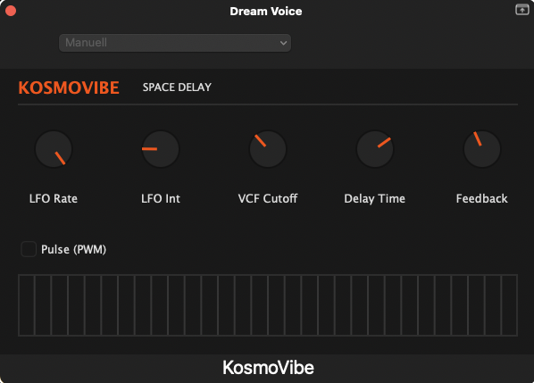

  

  # 🚀 KosmoVibe Space Delay

  **An authentically modeled, aggressively analog space delay and ribbon synthesizer plugin (VST3 / AU / Standalone).** 
  *Crafted with passion by **Addek-Labs**.*
  
  

---

## 🌌 Enter The Void

**KosmoVibe** is a meticulous, component-level emulation of classic Japanese mini-synthesizers from the 1980s. Designed with a raw, minimalist "dark mode" interface, KosmoVibe focuses purely on sound: marrying an analog-modeled oscillator with a screaming Zero-Delay Feedback filter and a gritty, tape-style echo.

Whether you want to add a subtle retro flavor to a vocal track, or push the feedback into endless self-oscillation for a sci-fi soundscape—KosmoVibe delivers pure, unfiltered analog chaos.

### ✨ Key Features

- 🎹 **Unquantized Ribbon Controller:** Play it like an instrument. Drag across the touch strip at the bottom of the UI to sweep the oscillator from a subsonic 50Hz all the way up to a piercing 4kHz.
- 🎛️ **ZDF Sallen-Key Filter (MS-20 Style):** A highly aggressive, Zero-Delay Feedback low-pass filter driven by non-linear `tanh` saturation.
- 📼 **PT2399-Style Tape Delay:** A fractional delay line featuring true analog pitch-warbling. Pushing the feedback past 100% unleashes harmonic self-oscillation.
- 🌊 **Morphable LFO:** Modulate the pitch with either a smooth triangle wave or an edgy pulse width modulation (PWM).
- 🛡️ **Master Soft-Clipper:** Drive the internal circuits as hot as you want without digitally clipping your DAW's master bus.

---

## 📥 Installation

You don't need to compile anything yourself! We provide ready-to-use binaries directly from our automated cloud build system.

1. Go to the [**Releases Page**](https://github.com/addek-lab/KosmoVibe/releases) on this repository.
2. Download the ZIP file for your operating system from the latest release:
   - **`KosmoVibe-Windows`** (Contains the `.vst3` and `.exe` Standalone app).
   - **`KosmoVibe-macOS`** (Contains the `.vst3`, `.component` for AU, and `.app` Standalone app).

### Setup Instructions
- **Windows:** Extract the `.vst3` file and place it in `C:\Program Files\Common Files\VST3\`.
- **macOS:** 
  - Place the `.vst3` file in `/Library/Audio/Plug-Ins/VST3/`.
  - Place the `.component` file in `/Library/Audio/Plug-Ins/Components/`.

---

  <i>KosmoVibe is brought to you by <b>Addek-Labs</b>. Unleash the analog chaos.</i>

