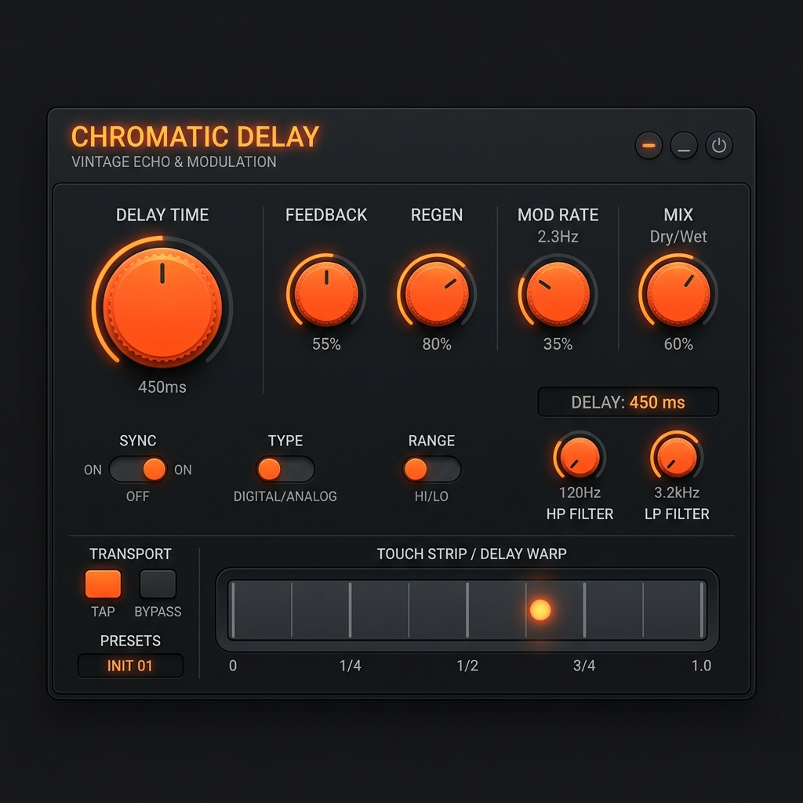

<div align="center">
  

  # 🚀 KosmoVibe Space Delay

  **An authentically modeled, aggressively analog space delay and ribbon synthesizer plugin (VST3 / AU / Standalone).**<br>
  *Crafted with passion by **Addek-Labs**.*
  
  [](https://github.com/addek-lab/KosmoVibe/actions/workflows/build.yml)
</div>

---

## 🌌 Enter The Void

**KosmoVibe** is not just another delay. It is a meticulous, component-level emulation of classic Japanese mini-synthesizers from the 1980s. Designed to bring chaotic, warm, and unpredictably organic textures to your DAW, KosmoVibe marries an analog-modeled oscillator with a screaming Zero-Delay Feedback filter and a gritty, tape-style echo.

Whether you want to add a subtle retro flavor to a vocal track, or push the feedback into endless self-oscillation for a sci-fi soundscape—KosmoVibe delivers.

### ✨ Key Features

- 🎹 **Unquantized Ribbon Controller:** Play it like an instrument. Drag across the touch strip to sweep the oscillator from a subsonic 50Hz all the way up to a piercing 4kHz.
- 🎛️ **ZDF Sallen-Key Filter (MS-20 Style):** A highly aggressive, Zero-Delay Feedback low-pass filter driven by non-linear `tanh` saturation. It bites, it screams, and it distorts beautifully.
- 📼 **PT2399-Style Tape Delay:** A fractional delay line featuring true analog pitch-warbling. Tweak the delay time mid-echo to bend pitch just like a tape machine. Pushing the feedback past 100% unleashes harmonic self-oscillation.
- 🌊 **Morphable LFO:** Modulate the pitch with either a smooth triangle wave or an edgy pulse width modulation (PWM).
- 🛡️ **Master Soft-Clipper:** Drive the internal circuits as hot as you want. Our master soft-clipper ensures your DAW output stays warm, thick, and strictly below 0 dBFS.

---

## 📥 Installation

You don't need to compile anything yourself! We provide ready-to-use binaries directly from our automated cloud build system.

1. Go to the [**Actions Tab**](https://github.com/addek-lab/KosmoVibe/actions) on this repository.
2. Click on the latest successful build.
3. Scroll down to the **Artifacts** section and download the ZIP file for your operating system:
   - **`KosmoVibe-Windows`** (Contains the `.vst3` and `.exe` Standalone app).
   - **`KosmoVibe-macOS`** (Contains the `.vst3`, `.component` for AU, and `.app` Standalone app).

### Setup Instructions
- **Windows:** Extract the `.vst3` file and place it in `C:\Program Files\Common Files\VST3\`.
- **macOS:** 
  - Place the `.vst3` file in `/Library/Audio/Plug-Ins/VST3/`.
  - Place the `.component` file in `/Library/Audio/Plug-Ins/Components/`.

---

## 🛠️ Building from Source

Are you a C++ developer? KosmoVibe is built entirely using the modern **JUCE 8** framework and CMake.

```bash
# 1. Clone the repository
git clone https://github.com/addek-lab/KosmoVibe.git
cd KosmoVibe

# 2. Configure with CMake
cmake -S . -B build -DCMAKE_BUILD_TYPE=Release

# 3. Compile the Plugin
cmake --build build --config Release
```
*Note: The JUCE library is automatically downloaded and linked via `FetchContent` during the CMake configuration step.*

---

<div align="center">
  <i>KosmoVibe is brought to you by <b>Addek-Labs</b>.<br>Unleash the analog chaos.</i>
</div>
